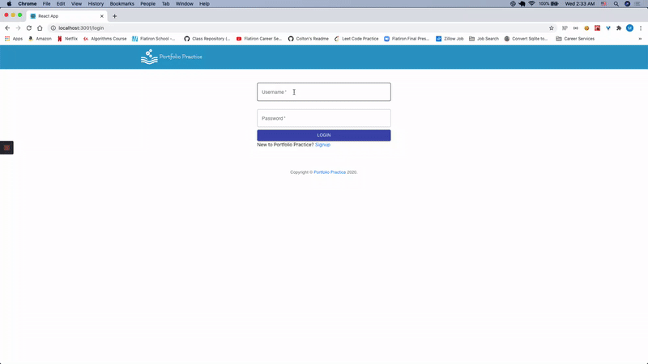
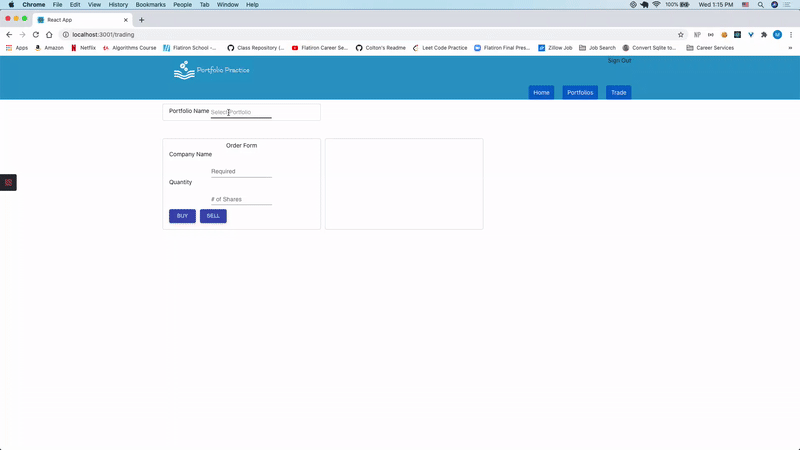

# Portfolio Practice - Frontend

An application that provides users the ability to practice buying and selling S&P 500 stocks using live stock market data. This [link](https://github.com/matthewsedlacek/Portfolio-Practice-Backend) will direct you to the backend repository.

## Motivation

Portfolio Practice was created to be an educational tool for new investors and finance students. The application empowers new investors with a no risk opportunity to practice buying and selling stocks. To encourage user engagement users are rewarded with stock awards when they try new strategies and realize gains. The application also provides users with breaking news stories realted to the stock market.

## Installation

1. Fork this repository
2. Run `npm install` in terminal
3. Run the backend server - refer to [backend](https://github.com/matthewsedlacek/Portfolio-Practice-Backend) repository
4. The Stock News and Finnhub APIs each require a key which you can obtain from here [Stock News](https://stocknewsapi.com/) & [Finnhub](https://finnhub.io/).
5. Create a file called ".env" outside of src folder.
6. Add Stock News and Finnhub API keys as variables to the .env file as such
   `REACT_APP_FINNHUB_API_KEY="<yourKey>"` `REACT_APP_NEWS_API_KEY=<yourKey>`.
7. Run `npm start` in your terminal
8. Enjoy Portfolio Practice

To view an active user please feel free to access the following user account

- username: gordongekko
- password: money

## Features

Users can:

**Login/Signup Pages**

- Log in to their account
- Signout of their account
- Create a new account

**Profile Page**

- View awards earned from trading
- View news stories related to the stock market
- View stock price and daily change of stocks in watchlist
- Add stocks to watchlist
- Delete stocks from watchlist

**Portfolio Page**

- Create a portoflio
- View portoflio transactions
- View gains and losses on their stock transactions
- View value, available cash, and buying power of their portfolios

**Trading Page**

- Buy stocks for specified portfolio
- Sell stocks for specified portfolio
- View company stock information
- View portfolio information

**Coming Soon**

- List of terms and equations useful for stock trading.
- Graph showing users returns vs. S&P 500
- Preview of transaction before submit

## Technology Used

- React
- Rails as API
- React
- Boostrap
- Material UI

## Author

- Matthew Sedlacek - [Github](https://github.com/matthewsedlacek) [LinkedIn](https://www.linkedin.com/in/matthew-sedlacek/)

## Collaborators

Helen Johns

- UX/UI Designer

## External APIs

Finnhub.io

- Stock Market API

Stocknewsapi.com

- Stock Market News API

## Licensing

This program is free software; you can redistribute it and/or modify it under the terms of the GNU General Public License as published by the Free Software Foundation; either version 2 of the License, or (at your option) any later version.
This program is distributed in the hope that it will be useful, but WITHOUT ANY WARRANTY; without even the implied warranty of MERCHANTABILITY or FITNESS FOR A PARTICULAR PURPOSE. See the GNU General Public License for more details.
For a copy of the GNU General Public License along write to the Free Software Foundation, Inc., 51 Franklin Street, Fifth Floor, Boston, MA 02110-1301 USA.
